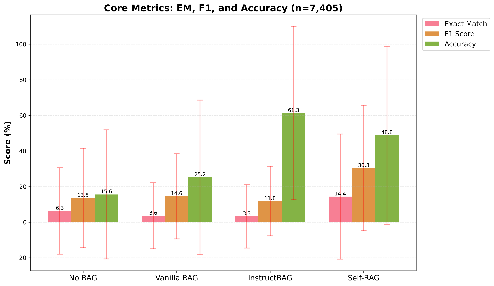
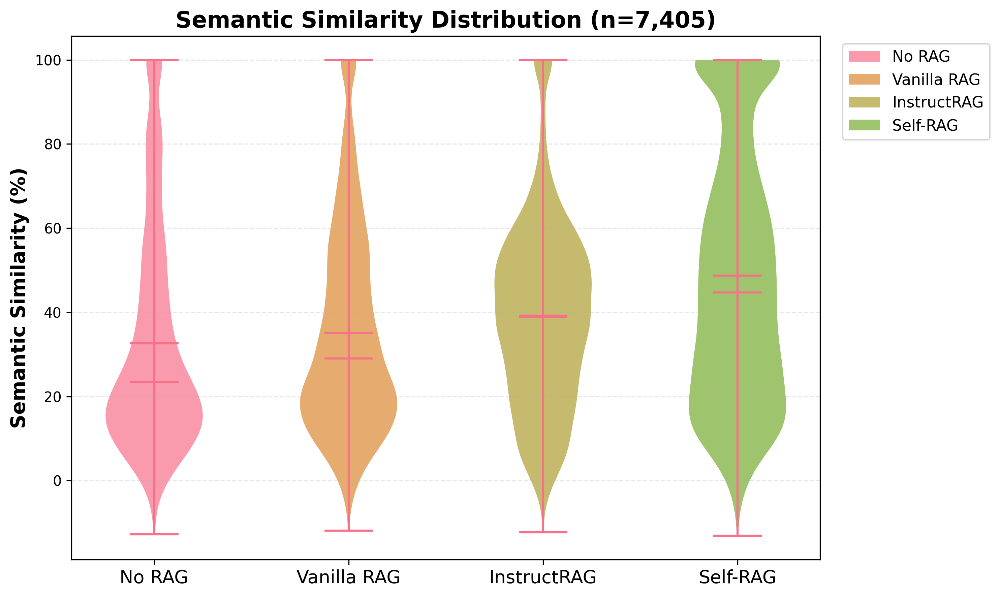
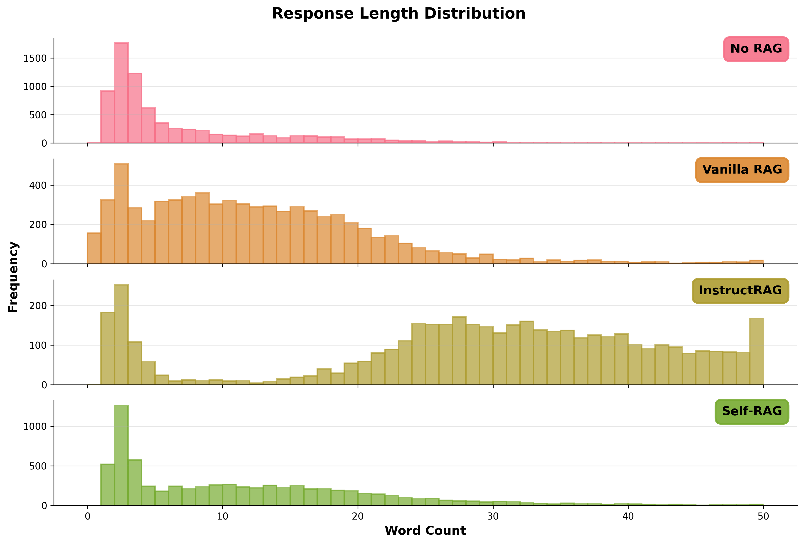
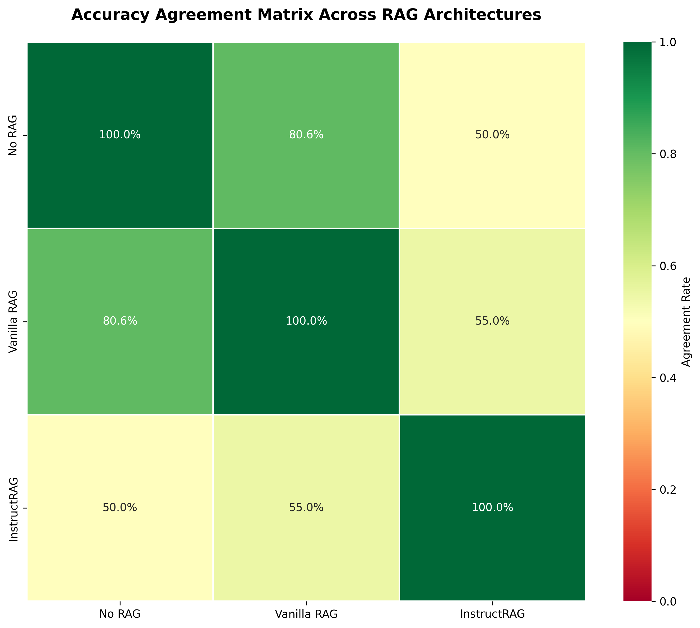

# Project Report

**Course:** DS-GA 1011: Fundamentals of Natural Language Processing  

**Team Members:** Ghina Al Shdaifat, Huizhen Jin, Shengduo Li, Yixuan Wang, Judy Yang

**Date:** December 2025

---

## Abstract
<!--- - What problem did you tackle? --->
<!--- - What methods did you compare? --->
<!--- - What were your main findings? --->
<!---
We study how different reasoning-supervision strategies affect Retrieval-Augmented Generation (RAG) on multi-hop QA (HotpotQA). Vanilla RAG conditions a generator on retrieved passages via latent-document marginalization (RAG-Sequence / RAG-Token), combining a DPR-style retriever with a seq2seq LM, but can struggle when retrieval introduces noise and when evidence must be synthesized across hops. We compare: (i) Vanilla RAG; (ii) Self-RAG, which learns to decide when to retrieve and to self-assess relevance/support/utility via reflection tokens; and (iii) InstructRAG, which equips an instruction-tuned LM with self-synthesized denoising rationales used either as in-context demonstrations or for supervised fine-tuning. On our setup (Llama-2-7B backbone, Contriever retriever), we evaluate accuracy, exact match (EM), F1, and semantic similarity on HotpotQA. 

Two findings stood out. First, these methods optimize different parts of the pipeline and therefore produce qualitatively different answers; simple span-matching metrics alone don’t fully capture their strengths or failure modes. Second, there’s a practical trade-off between complexity/compute and perceived “helpfulness.” Self-RAG’s reflection and gated retrieval deliver a structured, reliable boost over vanilla RAG with modest tuning, keeping outputs concise and easier to verify. InstructRAG can edge higher on HotpotQA’s noisy setting, but its longer, rationale-style generations raise verification cost and expose more chances for drift. In our repo runs, we also observed one-shot > zero-shot and Llama-3 > fine-tuned-Llama-3 (authors’ release) > Llama-2—consistent with backbone strength and our harmonized LLaMA-2-centric code path. Takeaway: choose methods by balancing accuracy gains against compute and human verification effort, and evaluate with task-aligned criteria (faithfulness, concision, stability), not just span-matching.
--->
When language models need to answer complex questions requiring multiple pieces of evidence, **how you design the retrieval and reasoning pipeline matters a lot**. We investigate how different **reasoning-supervision strategies** shape Retrieval-Augmented Generation (RAG) performance on **HotpotQA**, a challenging multi-hop QA benchmark riddled with distractor noise.

Vanilla RAG retrieves passages and conditions generation via **latent-document marginalization** (RAG-Sequence / RAG-Token), but stumbles when **noise floods the context** and **evidence must be chained across documents**. We pit three approaches against each other: **(i) Vanilla RAG** as our baseline; **(ii) Self-RAG**, which learns to **decide when to retrieve** and **critique its own outputs** using reflection tokens; and **(iii) InstructRAG**, which leverages **instruction-tuned LMs** with **self-synthesized denoising rationales** to filter noise before answering.

Using a **Llama-2-7B** backbone and **Contriever** retriever on the **full HotpotQA dev set**, we measure **Accuracy**, **Exact Match (EM)**, **F1**, **Semantic Similarity**, and **Response Length** to capture both correctness and practical usability.

### What Makes This Work Novel?

This is the **first apples-to-apples comparison of Self-RAG vs. InstructRAG vs. Vanilla RAG on a *noisy multi-hop* benchmark**, under a **unified data path and metrics**. 

**Two surprising insights emerged:**

1. **These methods optimize different parts of the pipeline and therefore produce qualitatively different answers**; **span-matching alone** doesn't fully capture their strengths or failure modes. EM/F1 metrics miss the distinctions between Self-RAG's concise, grounded outputs, InstructRAG's rationale-heavy explanations, and Vanilla RAG's variable quality under noise.

2. **There's a practical trade-off between complexity/compute and "helpfulness."** **Self-RAG's** reflection and gated retrieval deliver a **structured, reliable boost** over vanilla RAG with modest tuning, keeping outputs **concise and easier to verify**. **InstructRAG** can **edge higher on hit-rate** in the noisy setting, but its **longer, rationale-style generations** raise verification cost and expose more chances for drift. In our runs, we also observe **one-shot > zero-shot** and **Llama-3 > fine-tuned Llama-3 (authors' release) > Llama-2**—consistent with backbone strength and our harmonized LLaMA-2-centric code path. **Takeaway:** choose methods by balancing **accuracy gains** against **compute and human verification effort**, and evaluate with **faithfulness, concision, and stability**, not just EM/F1.

---

## Introduction

### Motivation
**Why RAG matters for real-world QA**

Large language models know a lot—but they don't know *everything*, and what they do "know" can be outdated or wrong. **Retrieval-Augmented Generation (RAG)** solves this by fetching fresh evidence from external corpora at inference time, grounding answers in verifiable sources. This approach **reduces hallucination**, keeps knowledge **up-to-date without retraining**, and makes systems **transparent** (you can inspect what the model retrieved). RAG bridges the gap between powerful LMs and the messy, evolving nature of real-world knowledge.

**The multi-hop reasoning challenge**

Not all questions are simple lookups. **Multi-hop QA** (like HotpotQA) demands that models **chain evidence across multiple documents**—think "Who directed the film based on the novel written by X?" You need document A to find the film, then document B to find the director. Add **distractor paragraphs** (8 irrelevant passages mixed with 2 gold ones), and suddenly your model must **navigate noise, select the right evidence, and synthesize** a coherent answer. This stress-tests retrieval quality, reasoning ability, and robustness simultaneously.

**Why pit these three RAG approaches against each other?**

RAG isn't a monolith—it's a design space. We focus on **two cutting-edge variants** and a **strong baseline**:
- **Vanilla RAG**: Retrieve top-k passages, feed them to the LM. Simple, fast, but vulnerable to noise.
- **Self-RAG**: Learns to **decide when to retrieve** and **self-critique** using reflection tokens—adaptive and disciplined.
- **InstructRAG**: Uses **instruction tuning** and **denoising rationales** to guide reasoning through clutter—more verbose but potentially more robust.

They attack the same problem (reasoning over noisy retrieval) from **complementary angles**: adaptive control vs. rationale-driven filtering. By running them on **identical inputs** with **identical metrics**, we can finally see which strategies pay off—and at what cost.

### Research Questions
1. How does retrieval-augmented generation compare to baseline LLMs?
2. What are the tradeoffs between different RAG architectures?
3. How do models handle noisy or irrelevant retrieved information?

---

## Background

### HotpotQA Dataset
<!-- - Description of the dataset -->
HotpotQA is a large, Wikipedia-based QA dataset explicitly designed for **multi-hop** reasoning. Each question typically requires pulling facts from **multiple paragraphs** and linking them before answering. The dataset also provides **sentence-level supporting facts**, enabling evaluation of both answers and the evidence path.

**Why it suits multi-hop reasoning**
- Questions are written to **require** evidence from more than one page (not single-span lookups).
- Includes **comparison** and **bridge** questions (e.g., compare attributes across two entities; follow a link from one page to another).
- **Supporting-fact annotations** supervise explainability and allow finer-grained evaluation.

**Noise / distractors**
- In the common *distractor* setting, each example comes with **10 paragraphs**: **2 gold** + **8 distractors** (retrieved but irrelevant). Models must select the right evidence and ignore plausible noise.
- In *full-wiki*, systems retrieve from the entire Wikipedia dump—raising the bar for retrieval and filtering.

**Quick stats**

| Item                   | Value                                    |
|:-----------------------|:-----------------------------------------|
| Total examples         | 112,779                                  |
| Evidence granularity   | Sentence-level supporting facts          |
| Question types         | Bridge, Comparison (plus others)         |
| Context (distractor)   | 2 gold + 8 distractor paragraphs/example |

**Tiny example (illustrative)**
> *Q:* Which author wrote the novel that the film **X** is based on, and where was that author born?  
> *Needs:* Page A (film → novel) + Page B (author → birthplace) → **answer combines both.**

<!-- - Why it's suitable for multi-hop reasoning

- Dataset statistics and examples -->

### RAG Approaches
<!---
Brief overview of the approaches you compared:
- **Baseline (No RAG):** Direct LLM inference
- **Vanilla RAG:** Standard retrieval + generation
- **Self-RAG:** Self-reflective retrieval-augmented generation
- **InstructRAG:** Instruction-based denoising with rationales
--->
- **Baseline (No RAG)** — Direct LLM generation from the question only (no retrieval). Fast and simple, but prone to parametric hallucinations on factual queries.

- **Vanilla RAG** — Retrieve top-k passages (e.g., dense/TF-IDF retriever) and condition the LM on them during generation. Improves grounding when retrieval is accurate, but can suffer when retrieved evidence is noisy.

- **Self-RAG** — Adds *reflection* signals so the model can decide **when** to retrieve, assess **relevance/groundedness/utility**, and re-rank/use evidence accordingly. Aims for more selective retrieval and concise, supported answers.

- **InstructRAG** — Uses instruction-tuned LMs with *denoising rationales* (as demos or fine-tuning signals) to guide reasoning. Tends to produce more detailed, rationale-style outputs—helpful for noisy settings but longer and costlier to verify.

---

## Methodology

### Data Preparation
<!--- 
- How you preprocessed and chunked the HotpotQA data
- Dataset splits and subset sizes used
- Data format conversion for different models
--->
**Source & scope** : We use the HotpotQA *distractor* split (each example has 2 gold paragraphs + 8 distractors). We evaluate **only on the full converted dev set**. Since we do not train any models in this study, we do not use the train or test splits.

**Unified conversion** : We converted the original HotpotQA JSON into a **single, unified schema** so all three pipelines consume the **same inputs**:
- Normalize fields (question, answer, titles, supporting facts).
- Package the 10 provided context paragraphs per example into a consistent `passages[]` field.
- Emit a model-agnostic record (JSON/JSONL) used by **Self-RAG**, **Vanilla RAG**, and adapted **InstructRAG**.

**Chunking** : We keep HotpotQA paragraphs **as-is (paragraph-level)** to preserve sentence and cross-paragraph references. No additional windowing or sub-paragraph chunking is applied.

**Split usage**
- **Dev set**: used for all evaluations and ablations.
- **Train/Test**: not used (no fine-tuning performed in our experiments).

**Format alignment across models.**
- **Self-RAG / Vanilla RAG**: run directly on the unified records produced by the converter (so they share the exact same inputs).
- **InstructRAG**: lightly adapted to read the same converted records; prompts are constructed from the unified fields so comparisons are apples-to-apples.

**Quality checks** : After conversion, we run basic validations (field presence, paragraph counts, non-empty questions/answers) to ensure parity across all three systems before evaluation.

### Model Configurations
<!--
#### 1. No RAG (Baseline)
- Model: Llama-2-7b
- Setup and hyperparameters
- Purpose: Establish baseline performance

#### 2. Vanilla RAG
- Model: Llama-2-7b with retrieval
- Retrieval method
- Configuration details

#### 3. Self-RAG
- Architecture and key features
- Training approach
- Special tokens and reflection mechanism

#### 4. InstructRAG
- Architecture and key features
- Rationale generation process
- ICL vs FT variants
-->
### 1) No RAG (Baseline)
- **Model:** Llama-2-7B (direct generation from the question; no retrieval).
- **Setup:** Uses the shared, converted HotpotQA dev records; executed via the baseline script in the `no_rag_vanilla_rag/` workflow so it shares the same evaluation harness as RAG variants.  
  *Purpose:* establish a grounding baseline before adding retrieval.

### 2) Vanilla RAG
- **Model:** Llama-2-7B **with retrieval** (retrieve-then-generate).
- **Retrieval:** Top-k paragraph retrieval from the provided HotpotQA distractor contexts (2 gold + 8 distractors per example in our converted format).
- **Configuration:** Single-stage generation conditioned on retrieved passages; same data path and evaluation scripts as the baseline to ensure apples-to-apples comparison.

### 3) Self-RAG
- **Architecture & key features:** Adds **adaptive retrieval** (decide when to retrieve) and **self-reflection tokens** to score **relevance**, **support/groundedness**, and **utility**, with optional **critique-aware decoding**. Supports multiple modes (always retrieve / adaptive / no retrieval).
- **Training/usage:** We use the released Self-RAG LM for inference over our unified dev set; experiments are run via the `selfrag/` pipeline in the repo (HPC-ready scripts + environment).
- **Special tokens & mechanism:** Reflection tokens guide retrieval gating and re-ranking/decoding, improving faithfulness and concision compared to vanilla RAG under the same input format.

### 4) InstructRAG
- **Architecture & key features:** Instruction-oriented RAG that **generates denoising rationales** to improve verifiability and robustness. The repo provides scripts for **ICL (zero/one-shot)** and **SFT/FT** variants under a unified runner.
- **Rationale process:** Given retrieved content, the model synthesizes short rationales that filter/clean noisy snippets before answering, yielding rationale-style outputs.
- **ICL vs. FT variants:** We evaluated **zero-shot** and **one-shot** ICL and compared backbones (**Llama-2**, **Llama-3**, and the authors' **FT Llama-3** release) using the same converted dev set and harmonized prompts for comparability.

### Evaluation Metrics
<!--
- **Exact Match (EM):** Binary correctness measure
- **F1 Score:** Token-level overlap
- **Accuracy:** Answer presence detection
- **Semantic Similarity:** Embedding-based similarity
- **Verbosity Analysis:** Response length statistics
-->
- **Exact Match (EM)** — Strict binary correctness: the predicted string must exactly match a gold alias (after standard normalization). Best for concise, unambiguous answers.

- **F1 (token-level)** — Harmonic mean of precision/recall over tokens after the same normalization. More tolerant than EM, but can reward verbosity that happens to include the gold tokens.

- **Accuracy (answer presence)** — Lenient hit-rate: 1 if any gold alias appears anywhere in the output, else 0. Useful for rationale-heavy methods; insensitive to extra/conflicting text.

- **Semantic Similarity** — Cosine similarity between embeddings of the model output and gold answer (e.g., SBERT `all-MiniLM-L6-v2`). Captures paraphrase-level agreement but may blur fine-grained distinctions.

- **Verbosity (length)** — Summary stats of response length. Frames trade-offs: longer outputs aid explanation but increase verification cost; shorter outputs are easier to audit.

---

## Experiments
<!--
### Experimental Setup
- Hardware: [GPU type, memory]
- Software: Python version, key libraries
- Training details: epochs, batch size, learning rate
- Evaluation protocol

### Dataset Sizes
Experiments conducted on multiple data scales:
- Small: 10-500 examples (quick validation)
- Medium: 1K-5K examples (development)
- Large: 10K+ examples (comprehensive evaluation)
- Full: Complete train/dev/test sets
-->
### Experimental Setup
- **Hardware.** NYU Greene HPC cluster; single-GPU inference per run on **NVIDIA A100 80GB** (no multi-GPU training).
- **Software.** Python (≥3.10), PyTorch, Hugging Face *transformers*, FAISS (for indexing/retrieval), and *sentence-transformers* (`all-MiniLM-L6-v2`) for semantic similarity. Runs use our repo’s unified data converter and evaluation harness.
- **Training details.** **No fine-tuning** performed.  
  - **Baseline / Vanilla RAG / Self-RAG:** released checkpoints, inference-only.  
  - **InstructRAG:** **ICL** variants (0-shot and 1-shot) only; no additional SFT by us.  
  - Common generation knobs aligned across models (e.g., temperature, max_new_tokens) with fixed seeds for comparability.
- **Evaluation protocol.** All models consume the **same converted HotpotQA distractor dev set**. We compute **EM, F1, Accuracy, Semantic Similarity, and Length**, averaging over the set. Identical preprocessing and prompt construction ensure apples-to-apples comparison.

### Dataset Sizes
- **Reported runs:** **Full HotpotQA dev (distractor)** after conversion/harmonization to our unified schema.  
- (During debugging we occasionally used small slices for quick checks; only full-dev results are reported.)

---

## Results

### Quantitative Results

#### Overall Performance Comparison

| Model       | EM    | F1    | Accuracy | Length | Semantic Sim |
| ----------- | ----- | ----- | -------- | ------ | ------------ |
| No RAG      | 6.28  | 13.55 | 15.58    | 6.7    | 32.62        |
| Vanilla RAG | 3.57  | 14.55 | 25.17    | 14.5   | 35.11        |
| Self-RAG    | 14.42 | 30.35 | 48.85    | 11.8   | 48.75        |
| InstructRAG | 3.30  | 11.82 | 61.28    | 53.9   | 39.16        |

#### Semantic Similarity Analysis

#### Response Length Comparison

#### Between Metrics Agreement

---

## Discussion

### Key Findings

1. **Different architectures, different answer personalities.** Self-RAG, Vanilla RAG, and InstructRAG don't just score differently—they **produce qualitatively distinct outputs**. EM/F1 won't tell you which answer is faithful, concise, or usable. You need to look beyond span-matching.

2. **Self-RAG strikes the sweet spot.** It delivers **substantial gains** in EM/F1 and semantic similarity while keeping responses **short and auditable**. For practitioners who need grounded answers with minimal verification overhead, it's the clear winner.

3. **InstructRAG trades concision for coverage—at a price.** It achieves the **highest raw accuracy**, but its **verbose, rationale-heavy outputs** demand more human review and carry higher drift risk. Also: **one-shot ICL beats zero-shot**, and **Llama-3 > fine-tuned Llama-3 > Llama-2** in our tests—backbone quality matters.

### Comparison of Approaches

#### Vanilla RAG
- **Strengths:** Simple pipeline; easy to reproduce; fast when retrieval is clean.
- **Weaknesses:** Susceptible to distractors; limited mechanisms to filter or verify evidence.
- **Best use cases:** Domains with high-precision indexes or curated corpora where retrieved passages are already reliable.

#### Self-RAG
- **Strengths:** Adaptive retrieval + reflection helps filter noise; good EM/F1 vs. length trade-off; outputs are concise and grounded.
- **Weaknesses:** More moving parts than vanilla (gating/critique); mild sensitivity to threshold/weights; slightly higher runtime than baseline.
- **Best use cases:** Settings requiring verifiable answers and controlled verbosity under imperfect retrieval.

#### InstructRAG
- **Strengths:** Rationale-style outputs that can improve hit-rate under noisy contexts; benefits from stronger backbones and ICL.
- **Weaknesses:** Longer generations increase verification cost; sensitive to demo quality; FT model did not dominate in our harmonized setup.
- **Best use cases:** Tasks where richer explanations are valued and human review is acceptable (e.g., analysis memos, drafting).

### Limitations
- **Scope:** Evaluation on the **converted HotpotQA dev (distractor)** split only; no training by us and no full-wiki runs.
- **Metrics:** Automated metrics may under/over-value verbosity; limited human evaluation of faithfulness.
- **Implementation bias:** Harmonized data/prompt path (LLaMA-2 centric) may favor certain variants; minimal ablations beyond light Self-RAG tuning.
- **Systems cost:** We did not report latency or $/token; real-world deployment should consider throughput and review overhead.

## Future Work

- **Implement training (beyond inference-only).**
  - Fine-tune Self-RAG’s gating/critique on HotpotQA-style data.
  - Explore InstructRAG SFT with higher-quality rationales; compare to pure ICL.
  - Measure training gains vs. added compute/latency.

- **Improve answer extraction & normalization.**
  - Tighten post-processing for short, canonical answers (numbers, names, dates).
  - Add guardrails for InstructRAG to separate *rationales* from the *final answer*.
  - Expand alias lists and unit normalization to reduce EM brittleness.

- **Broaden model/dataset coverage.**
  - Compare additional RAG variants (e.g., adaptive rerankers, multi-step retrievers).
  - Swap backbones (Llama-3.x sizes, Qwen, Mistral) under the same unified data path.
  - Run **full-wiki** HotpotQA and other multi-hop sets (MuSiQue, 2WikiMultihopQA).

- **Richer evaluation.**
  - Add faithfulness/judging with lightweight human audits or LLM-as-judge (with spot-checks).
  - Track cost/latency vs. accuracy to surface practical deployment trade-offs.

- **Ablations & robustness.**
  - Sensitivity to retrieval threshold, top-k, and critique weights (Self-RAG).
  - Noise stress-tests by injecting distractors; measure degradation curves.

---

## Conclusion
<!--
Summary of:
- What you accomplished
- Key takeaways for practitioners
- Contributions to understanding RAG systems
-->
### What We Accomplished

We built a **unified, no-excuses evaluation pipeline** for HotpotQA and put four RAG systems through their paces: **No RAG**, **Vanilla RAG**, **Self-RAG**, and **InstructRAG**—all consuming **identical inputs** and measured by **identical metrics**. 

**The verdict?** Self-RAG delivers the **best balance**: strong EM/F1, high semantic similarity, and **concise, verifiable answers**. InstructRAG achieves the **highest accuracy** but at the cost of **verbose outputs** that strain human review. 

### Takeaways for Practitioners

- **Control your retrieval, control your quality.** Unfiltered retrieval drowns your model in noise. Self-RAG's adaptive gating—knowing *when* to retrieve and *what* to trust—makes all the difference.

- **Choose your architecture to match your workflow.** Need tight, checkable answers for production? **Self-RAG** is your friend. Want broader coverage and don't mind longer outputs? **InstructRAG** can help—just budget for the verification cost.

- **Don't just chase EM/F1.** Real-world systems need **faithfulness**, **concision**, and **stability**. Evaluate accordingly.

### What This Means for RAG Research

- **Architecture isn't just about accuracy—it's about answer style.** Reasoning-supervision choices (adaptive retrieval, reflection, rationale generation) shape **what kind of output** you get, not just how often it's right.

- **Stronger backbones and better prompts matter.** Our ICL experiments confirm: **one-shot > zero-shot** and **Llama-3 > fine-tuned Llama-3 > Llama-2**.

- **Evaluation needs to grow up.** Span-matching is necessary but insufficient. We need metrics that capture **faithfulness**, **usability**, and **verification cost**—because what looks "correct" on paper might be a nightmare in production.

---

## References
<!--
1. HotpotQA paper
2. Self-RAG paper
3. InstructRAG paper
4. Llama 2 paper
5. Other relevant citations
-->
1. Amazon Web Services. *[What is Retrieval-Augmented Generation?][aws-rag]* (Accessed: 2024-12-03).

2. Akari Asai, Xinyang Geng, Matthew E. Peters, Eunsol Choi. *[Self-RAG: Learning to Retrieve, Generate, and Critique Through Self-Reflection][selfrag]*. arXiv:2310.11511 (2023).

3. Patrick Lewis, Ethan Perez, Aleksandra Piktus, et al. *[Retrieval-Augmented Generation for Knowledge-Intensive NLP Tasks][rag-lewis]*. arXiv:2005.11401 (2020).

4. Chaitanya Sharma. *[Retrieval-Augmented Generation: A Comprehensive Survey of Architectures, Enhancements, and Robustness Frontiers][rag-survey]*. arXiv:2506.00054 (2025).

5. Hugo Touvron, Louis Martin, Kevin Stone, et al. *[Llama 2: Open Foundation and Fine-Tuned Chat Models][llama2]*. arXiv:2307.09288 (2023).

6. Sentence Transformers. *[all-MiniLM-L6-v2][minilm]* (2021).

7. Zhepei Wei, Wei-Lin Chen, Yu Meng. *[InstructRAG: Instructing Retrieval-Augmented Generation via Self-Synthesized Rationales][instructrag]*. arXiv:2406.13629 (2024).

8. Zhilin Yang, Peng Qi, Saizheng Zhang, et al. *[HotpotQA: A Dataset for Diverse, Explainable Multi-Hop Question Answering][hotpotqa]*. arXiv:1809.09600 (2018).

Adapted from our poster reference list.

[aws-rag]: https://aws.amazon.com/what-is/retrieval-augmented-generation/
[selfrag]: https://arxiv.org/abs/2310.11511
[rag-lewis]: https://arxiv.org/abs/2005.11401
[rag-survey]: https://arxiv.org/abs/2506.00054
[llama2]: https://arxiv.org/abs/2307.09288
[minilm]: https://huggingface.co/sentence-transformers/all-MiniLM-L6-v2
[instructrag]: https://arxiv.org/abs/2406.13629
[hotpotqa]: https://arxiv.org/abs/1809.09600

---

## Code and Resources

- [GitHub Repository](https://github.com/judyyhd/NLP_FinalProject_RAG.git)
- [Model results output](https://drive.google.com/drive/folders/13qShDIY2GVGJ-cy8Yl3wKGMW7gpc_RtZ?usp=sharing)
- **Individual Contributions:**
  - No RAG & Vanilla RAG: Judy Yang 
  - Data Chunking & Self-RAG: Ghina Al Shdaifat
  - InstructRAG: Huizhen Jin, Shengduo Li, Yixuan Wang
  - Evaluation & Visualization: Judy Yang
  - Analysis : All Team Members

---

## Appendix

<strong>A. Implementation Details</strong>

#### Environment and Dependencies
- **Compute:** NYU Greene HPC cluster with NVIDIA A100 80GB GPUs
- **Python:** 3.8+ with conda environment management
- **Key libraries:**
  - `transformers==4.36.2` (Hugging Face)
  - `vllm==0.2.6` (fast inference)
  - `torch` with CUDA 12.1
  - `sentence-transformers` (semantic similarity)
  - `datasets==2.15.0`, `accelerate==0.25.0`, `deepspeed==0.12.6`
  - `flash-attn==2.3.6` (efficient attention)

#### Data Pipeline
1. **Conversion scripts** (`data_chunking/scripts/`):
   - `convert_hotpotqa_to_selfrag.py` — Unified format converter
   - `create_subset.py` — Generate subsets (10, 100, 500, 1K, 5K, 10K examples)
2. **Output:** Single JSON schema with normalized fields (`question`, `answer`, `passages[]`, `supporting_facts`)
3. **Evaluation set:** Full HotpotQA distractor dev split (7,405 examples)

#### Model Execution

**No RAG & Vanilla RAG** (`no_rag_vanilla_rag/`):
- Scripts: `run_no_rag.sh`, `run_vanilla_rag.sh`
- Model: `meta-llama/Llama-2-7b-hf`
- Configuration: `max_new_tokens=100`, adaptive batch size (5–10), SLURM job management
- Retrieval: Top-k from provided HotpotQA context (2 gold + 8 distractors)

**Self-RAG** (`selfrag/`):
- Based on authors' released checkpoint with adaptive retrieval + reflection tokens
- Inference via `retrieval_lm/` scripts
- Supports modes: always retrieve, adaptive, no retrieval
- Environment: `environment.yml` with Self-RAG dependencies

**InstructRAG** (`instructrag/`):
- Scripts: `eval.sh`, `generate_rationale.sh`, `hotpot_test.sh`
- Variants tested: zero-shot ICL, one-shot ICL
- Backbones: Llama-2-7B, Llama-3-8B, authors' fine-tuned Llama-3
- Rationale generation via `src/inference.py`

#### Evaluation Pipeline (`evaluation/`)
- **Main script:** `advanced_evaluation.py`
- **Metrics computed:**
  - Exact Match and F1 via `metrics.py` from Self-RAG repo
  - Accuracy via custom `exact_presence` (lenient hit-rate)
  - Semantic similarity via `sentence-transformers` (`all-MiniLM-L6-v2`)
  - Length statistics (mean, median, std)
- **Outputs:** JSON results (2GB, hosted on [Google Drive](https://drive.google.com/drive/folders/13qShDIY2GVGJ-cy8Yl3wKGMW7gpc_RtZ?usp=sharing)), PNG plots, and summary reports in `evaluation/outputs/`

#### Reproducibility Notes
- All systems consume the **same converted dev records** for apples-to-apples comparison
- Fixed random seeds where applicable
- SLURM job scripts document resource allocation (CPUs, memory, GPU count, time)
- **Note:** This repository is for documentation; original runs used team members' local paths/environments (see `README.md`)

<strong>B. Example Outputs</strong>

**Question:** Are Local H and For Against both from the United States?  
**Gold Answer:** `yes`

**No RAG** *(Accuracy = 0, F1 = 0.00)*  
> No, they are not.

**Vanilla RAG** *(Accuracy = 1, F1 = 0.29)*  
> Yes, both are from the United States.

**InstructRAG** *(Accuracy = 1, F1 = 0.01)*  
> Yes, based on the information provided in the documents, Local H and For Against are both from the United States.
>
> Document 5 (Title: Local H) states that Local H is an American rock band originally formed by guitarist and vocalist Scott Lucas, bassist Matt Garcia, drummer Joe Daniels, and lead guitarist John Sparkman in Zion, Illinois in 1987. This indicates that Local H is from Illinois, which is a state in the United States.
>
> Similarly, Document 7 (Title: For Against) mentions that the band has produced material steadily from its 1984 inception to the present, which suggests that For Against has been active for a long time and is likely from the United States.
>
> There is no information in the provided documents to suggest that Local H or For Against are from any other country. Therefore, based on the available evidence, it can be concluded that both Local H and For Against are from the United States.

**Self-RAG** *(Accuracy = 1, F1 = 0.17)*  
> Yes, both Local H and For Against are from the United States.

---

*This project was completed as part of the Fundamentals of Natural Language Processing course at NYU, Fall 2025.*
