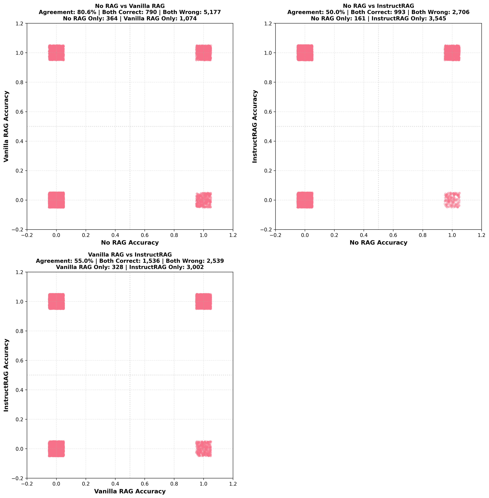
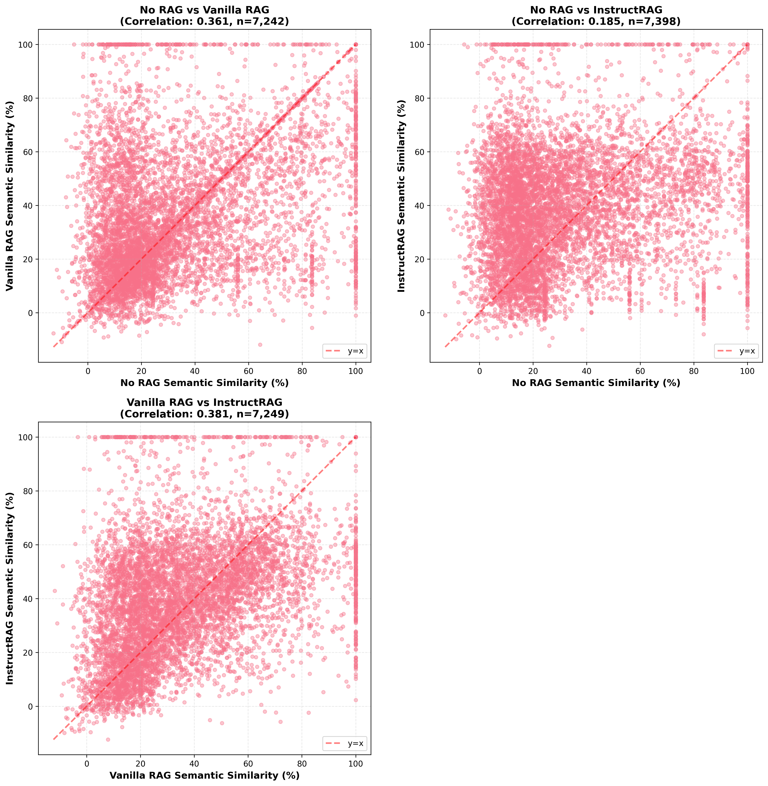
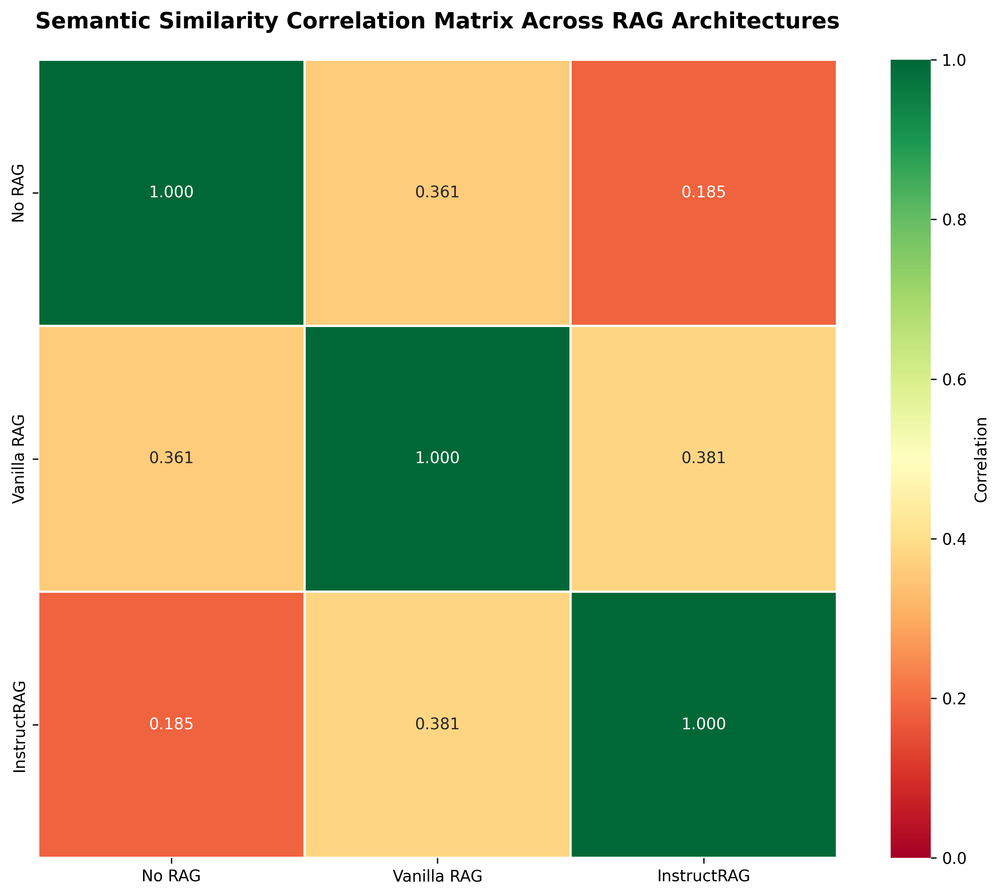

# Detailed Results and Analysis

[Back to Home](index.md)

---

## Performance Metrics Overview

### All Models - Development Set

Comprehensive comparison across all evaluation metrics.

#### Exact Match (EM) Scores
[Table with EM scores for all models across different data sizes]

#### F1 Scores
[Table with F1 scores]

#### Semantic Similarity
[Table with semantic similarity scores]

---

## Visual Analysis

### Core Metrics Comparison

### Accuracy Agreement Matrix
Shows where models agree/disagree on correct answers.

### Pairwise Accuracy Comparison

### Semantic Similarity Analysis

### Response Length Distribution

### Pairwise Semantic Similarity

### Semantic Similarity Correlation Matrix

---

## Statistical Significance

[Add statistical tests comparing models]

---

## Per-Dataset Analysis

### Development Set (500 examples)
- Best performing model: [Model name]
- Key observations: [Insights]

### Training Set (1K examples)
- Best performing model: [Model name]
- Key observations: [Insights]

### Training Set (5K examples)
- Best performing model: [Model name]
- Key observations: [Insights]

---

## Download Results

Complete result files (2GB) available on [Google Drive](evaluation/results/README.md).

[Back to Home](index.md)
